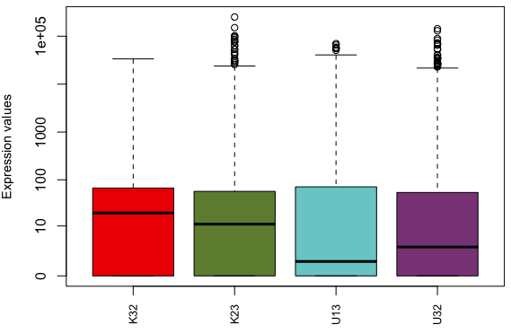
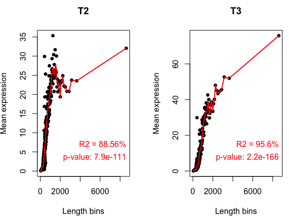
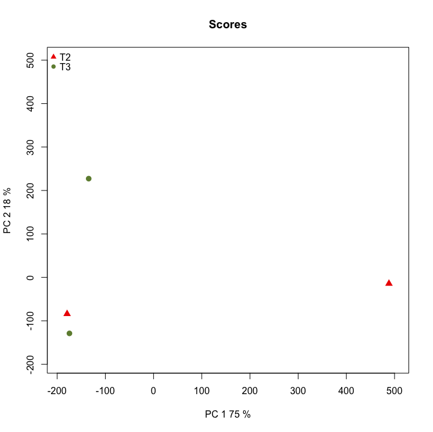

# RNA Sequence Analysis for Non Model Species Eastern larch (Tamarack)  
  
This repository is a usable, publicly available tutorial for analyzing differential expression data and creating topological gene networks. All steps have been provided for the UConn CBC Xanadu cluster here with appropriate headers for the Slurm scheduler that can be modified simply to run.  Commands should never be executed on the submit nodes of any HPC machine.  If working on the Xanadu cluster, you should use sbatch scriptname after modifying the script for each stage.  Basic editing of all scripts can be performed on the server with tools such as nano, vim, or emacs.  If you are new to Linux, please use [this](https://bioinformatics.uconn.edu/unix-basics) handy guide for the operating system commands.  In this guide, you will be working with common bio Informatic file formats, such as [FASTA](https://en.wikipedia.org/wiki/FASTA_format), [FASTQ](https://en.wikipedia.org/wiki/FASTQ_format), [SAM/BAM](https://en.wikipedia.org/wiki/SAM_(file_format)), and [GFF3/GTF](https://en.wikipedia.org/wiki/General_feature_format). You can learn even more about each file format [here](https://bioinformatics.uconn.edu/resources-and-events/tutorials/file-formats-tutorial/). If you do not have a Xanadu account and are an affiliate of UConn/UCHC, please apply for one **[here](https://bioinformatics.uconn.edu/contact-us/)**.  
  
### Contents  
1. [Introduction](#1-introduction)  
2. [Quality Control](#2-quality-control)   
3. [Assembling the Transcriptome](#3-assembling-the-transcriptome)  
4. [Identifying the Coding Regions](#4-identifying-the-coding-regions)  
5. [Determining and Removing Redundent Transcripts](#5-determining-and-removing-redundent-transcripts)
6. [Evaluating Assemblies](#6-evaluating-assemblies)
7. [Creating An Index](#7-creating-an-index)
8. [Extraction of Read Counts using Kallisto](#8-extraction-of-read-counts-using-kallisto)
9. [Diffferential Expression](#9-diffferential-expression)  
       a.    [Gfold](#a-differentially-expressed-genes-using-gfold)   
       b.    [NOISeq](#b-differentially-expressed-genes-using-noiseq) 
10. [EnTAP - Functional Annotation for DE Genes](#10-entap---functional-annotation-for-de-genes) 

 
 

## 1. Introduction  
  
In this tutorial we will be analyzing RNA-Sequence data from abscission zone tissue (between the needle and the stem) samples from the Eastern larch. The study is designed to examine the process of needle loss in Autumn. This data is not published and therefore can only be accessed through the Xanadu directory in `/UCHC/PublicShare/RNASeq_Workshop/Eastern_larch` We will be using the **Eastern larch as a non-model organism**.  
  
When an organism is called **model** there is an underlying assumption that very generous amounts of research have been performed on the species resulting in large pools of publicly available data. In biology and bioinformatics this means there are reference transcriptomes, structural annotations, known variant genotypes, and a wealth of other useful information in computational research. By contrast, when an organism is called **non-model** there is the underlying assumption that the information described prior will have to be generated by the research. This means that after extracting genetic data from a non-model organism, the researcher will then have to assemble the transcriptome, annotate the transcriptome, identify any pertinent genetic relationships, and so on. We can use this to develop a small map of our goals for analyzing our Eastern larch RNA samples. That is:  

  

The data consists of 4 libraries under two different time points (roughly one month apart). This is representing 3 trees for two populations (U and K).  


  Sample   |   Location   |   Time point  |   Population number    
  ----  |   ----   |   ----  |   ----
  U32   |  UConn  |   2  |   3 
  U13   |  UConn  |   3  |   1   
  K32   |  Killingworth   |   2   | 2   
  K23   |  Killingworth   |  3   |  2 

  
### Cloning the workflow 
In this workflow we have seperated each step into folders, where you can find the appropriate scripts in conjunction with each steps. When you clone the git repository, the below directory structure will be cloned into your working directory.   

So to follow the steps would be esay once you have cloned this git repository using the `clone` command:
```
git clone < git-repository.git >

```

Once you clone the repository you can see the following folder structure:  

```  
Eastern_larch/
├── Raw_Reads
├── Quality_Control
├── Assembly
├── Coding_Regions
├── Clustering
├── RNAQuast
├── Index
├── Counts
├── Gfold 
├── NOISeq
└── EnTAP
```  
   
###  SLURM scripts   
The tutorial will be using the SLURM scheduler to submit jobs to the University of Connecticut's Xanadu computer cluster. Each script we will be using will contain a header section which will allocate the resources for the SLURM scheduler. The header section will contain:  

```bash
#!/bin/bash
#SBATCH --job-name=JOBNAME
#SBATCH -n 1
#SBATCH -N 1
#SBATCH -c 1
#SBATCH --mem=1G
#SBATCH --partition=general
#SBATCH --qos=general
#SBATCH --mail-type=ALL
#SBATCH --mail-user=first.last@uconn.edu
#SBATCH -o %x_%j.out
#SBATCH -e %x_%j.err
```  

Before beginning, we need to understand a few aspects of the Xanadu server. When first logging into Xanadu from your local terminal, you will be connected to the submit node. The submit node is the interface with which users on Xanadu may submit their processes to the desired compute nodes, which will run the process. Never, under any circumstance, run processes directly in the submit node. Your process will be killed and all of your work lost! This tutorial will not teach you shell script configuration to submit your tasks on Xanadu. Therefore, before moving on, read and master the topics covered in the [Xanadu tutorial](https://bioinformatics.uconn.edu/resources-and-events/tutorials-2/xanadu/).  
  
### Linking the Raw Reads data  

These data files are only avaliable through Xanadu cluster, as they belong to the Dr. Jill Wegrzyn lab. If you are working in the Xanadu cluster to avoid redundancy in the data files, you can create a simlink to the read files. After creating sym-links you can work your way though the rest of the steps as we have discussed in the tutorial. 

So in the **Raw_Reads/** folder we have created a script to creat a sym-links for the actual data, which is called [raw_data_symlinks.sh](/Raw_Reads/raw_data_symlinks.sh), You can run this script using `sbatch` command.  
 
  
Raw_Reads folder will look like:  
```
Raw_Reads/
├── K23
│   ├── K23_R1.fastq
│   └── K23_R2.fastq
├── K32
│   ├── K32_R1.fastq
│   └── K32_R2.fastq
├── U13
│   ├── U13_R1.fastq
│   └── U13_R2.fastq
└── U32
    ├── U32_R1.fastq
    └── U32_R2.fastq 
```
   
### Familiarizing yourself with the raw reads

The reads with which we will be working have been sequenced using [Illumina](https://www.illumina.com/techniques/sequencing.html). We assume that you are familiar with the sequencing technology. Let's have a look at the content of one of our reads, which are in the "fastq" format:

```bash
head -n 4 K32_R1.fastq
```

which will show the first four lines in the fastq file:

```
@NS500402:381:HH3NFBGX9:1:11101:2166:1038 1:N:0:CGCTCATT+AGGCTATA
AGAACTCGAAACTAAACGTGGACGTGNTNNTATAAACNNANACNAATCCATCGCCGGTTNNCNTATNNNNNNNNNN
+
AAAAAEEEEEEEEEEEEEEEEEEEEE#E##EEEEEEE##E#EE#EEEE6EEEEEEEEEE##A#EAE##########
```

In here we see that first line corrosponds to the sample information followed by the length of the read, and in the second line corrosponds to the nucleotide reads, followed by the "+" sign where if repeats the information in the first line. Then the fourth line corrosponds to the quality score for each nucleotide in the first line.   
   
   
## 2. Quality Control

### Quality control of Illumina reads using Trimmommatic
Step one is to perform quality control on the reads, and we will be using Sickle for the Illumina reads. To start with we have paired-end reads.  

```bash
module load Trimmomatic/0.39

java -jar $Trimmomatic PE -threads 4 \
        ../Raw_Reads/U13/U13_R1.fastq \
        ../Raw_Reads/U13/U13_R2.fastq \
        trim_U13_R1.fastq singles_trim_U13_R1.fastq \
        trim_U13_R2.fastq singles_trim_U13_R2.fastq \
        ILLUMINACLIP:/isg/shared/apps/Trimmomatic/0.36/adapters/TruSeq3-PE-2.fa:2:30:10 \
        SLIDINGWINDOW:4:25 MINLEN:45

java -jar $Trimmomatic PE -threads 4 \
        ../Raw_Reads/U32/U32_R1.fastq \
        ../Raw_Reads/U32/U32_R2.fastq \
        trim_U32_R1.fastq singles_trim_U32_R1.fastq \
        trim_U32_R2.fastq singles_trim_U32_R2.fastq \
        ILLUMINACLIP:/isg/shared/apps/Trimmomatic/0.36/adapters/TruSeq3-PE-2.fa:2:30:10 \
        SLIDINGWINDOW:4:25 MINLEN:45

java -jar $Trimmomatic PE -threads 4 \
        ../Raw_Reads/K32/K32_R1.fastq \
        ../Raw_Reads/K32/K32_R2.fastq \
        trim_K32_R1.fastq singles_trim_K32_R1.fastq \
        trim_K32_R2.fastq singles_trim_K32_R2.fastq \
        ILLUMINACLIP:/isg/shared/apps/Trimmomatic/0.36/adapters/TruSeq3-PE-2.fa:2:30:10 \
        SLIDINGWINDOW:4:25 MINLEN:45


java -jar $Trimmomatic PE -threads 4 \
        ../Raw_Reads/K23/K23_R1.fastq \
        ../Raw_Reads/K23/K23_R2.fastq \
        trim_K23_R1.fastq singles_trim_K23_R1.fastq \
        trim_K23_R2.fastq singles_trim_K23_R2.fastq \
        ILLUMINACLIP:/isg/shared/apps/Trimmomatic/0.36/adapters/TruSeq3-PE-2.fa:2:30:10 \
        SLIDINGWINDOW:4:25 MINLEN:45

```
   
The usage information on the Trimmomatic program:  

```
java -jar trimmomatic-0.30.jar [-threads <threads>]  
	PE Sample_R1.fastq Sample_R2.fastq 
	paired_Sample_R1.fastq Single_Sample_R1.fastq 
	paired_Sample_R2.fastq Single_Sample_R2.fastq
	ILLUMINACLIP:TruSeq3-PE.fa:2:30:10 LEADING:3
	TRAILING:3 SLIDINGWINDOW:4:25 MINLEN:45

-threads : Threads for parallel processing
PE : Paired end samples
Sample_R1.fastq Sample_R2.fastq : Input sample files (R1 and R2)
paired_Sample_R1.fastq paired_Sample_R2.fastq : Output files of read where both pairs survived.
Single_Sample_R1.fastq Single_Sample_R2.fastq : Output files of read where only one read of the pair survived.

ILLUMINACLIP: Cut adapter and other illumina-specific sequences from the read.
SLIDINGWINDOW: Performs a sliding window trimming approach. It starts scanning at the 5‟ end and clips the read once the average quality within the window falls below a threshold.
MAXINFO: An adaptive quality trimmer which balances read length and error rate to
maximise the value of each read
LEADING: Cut bases off the start of a read, if below a threshold quality
TRAILING: Cut bases off the end of a read, if below a threshold quality
CROP: Cut the read to a specified length by removing bases from the end
HEADCROP: Cut the specified number of bases from the start of the read
MINLEN: Drop the read if it is below a specified length
```  

The `SLIDINGWINDOW` will calculate average phred score over defined window (above 4 bps) and when the average falls below the threshold (set to 25 here) the reads are trimmed. Another parameter is `MINLEN` which sets the minimum length of the read that is required to be accepted following the quality processing. `ILLUMINACLIP` is set to the path of fasta file containing adapter sequences in fasta format. Additional sequences can be added to the file if they have to be trimmed from the reads.

At the end of the run, each run will produce **4** files, a *trimmed forward read file*, *trimmed reverse read file* and two *singles file*. Singles file will contain the reads whose pair failed to pass the thresholds set in the trimmommatic step. The following files will be produced at the end of the run:  
```
Quality_Control/
├── singles_trim_K23_R1.fastq
├── singles_trim_K23_R2.fastq
├── singles_trim_K32_R1.fastq
├── singles_trim_K32_R2.fastq
├── singles_trim_U13_R1.fastq
├── singles_trim_U13_R2.fastq
├── singles_trim_U32_R1.fastq
├── singles_trim_U32_R2.fastq
├── trim_K23_R1.fastq
├── trim_K23_R2.fastq
├── trim_K32_R1.fastq
├── trim_K32_R2.fastq
├── trim_U13_R1.fastq
├── trim_U13_R2.fastq
├── trim_U32_R1.fastq
└── trim_U32_R2.fastq


```
  
The summary of the reads will be in the `*.err` file, which will give how many reads is kept and how many have been discarded in each run.  
  
| Sample | Input records | Paired records kept | Forward surviving | Reverse surviving | Records dropped | Kept (%) |   
| --- | --- | --- | --- | --- | --- | --- |   
| U13 | 24308740 | 19450852 | 2767617 | 843463 | 1246808 | 80.02 |   
| U32 | 23283138 | 19166285 | 2085260 | 858531 | 1173062 | 82.32 |   
| K32 | 20828110 | 16468780 | 2448484 | 759367 | 1151479 | 79.07 |     
| K23 | 22508598 | 18004494 | 2511606 | 751067 | 1241431 | 79.99 |   
   
   
   
       
## 3. Assembling the Transcriptome   
    
### De novo Assembling the Transcriptome using Trinity   
   
Now that we've performed quality control we are ready to assemble our transcriptome using the RNA-Seq reads. We will be using the software [Trinity](https://github.com/trinityrnaseq/trinityrnaseq/wiki). Nearly all transcriptome assembly software operates under the same premise. Consider the following:

Suppose we have the following reads:
```
A C G A C G T T T G A G A
T T G A G A T T A C C T A G
```

We notice that the end of each read is the beginning of the next read, so we assemble them as one sequence by matching the overlaps:
```
A C G A C G T T T G A G A
              T T G A G A T T A C C T A G
```

Which gives us:
```
A C G A C G T [T T G A G A] T T A C C T A G
```

    
### De novo Assembling the Transcriptome using Trinity

In De novo assembly section, we will be working in the **assembly/** directory. In here we will be assembling the trimmed illumina reads separately using the trinity transcriptome assembler. Assembly requires a great deal of memory (RAM) and can take few days if the read set is large. Following is the trinity command that we use to assemble each transcriptome separately.    
   
```bash
module load trinity/2.6.6

Trinity --seqType fq \
        --left ../Quality_Control/trim_U13_R1.fastq \
        --right ../Quality_Control/trim_U13_R2.fastq \
        --min_contig_length 300 \
        --CPU 36 \
        --max_memory 100G \
        --output trinity_U13 \
        --full_cleanup 

Trinity --seqType fq \
        --left ../Quality_Control/trim_U32_R1.fastq \
        --right ../Quality_Control/trim_U32_R2.fastq \
        --min_contig_length 300 \
        --CPU 36 \
        --max_memory 100G \
        --output trinity_U32 \
        --full_cleanup

Trinity --seqType fq \
        --left ../Quality_Control/trim_K32_R1.fastq \
        --right ../Quality_Control/trim_K32_R2.fastq \
        --min_contig_length 300 \
        --CPU 36 \
        --max_memory 100G \
        --output trinity_K32 \
        --full_cleanup

Trinity --seqType fq \
        --left ../Quality_Control/trim_K23_R1.fastq \
        --right ../Quality_Control/trim_K23_R2.fastq \
        --min_contig_length 300 \
        --CPU 36 \
        --max_memory 100G \
        --output trinity_K23 \
        --full_cleanup
```  
    
    
So the usage information for Trinity program we use:
```
Usage:  Trinity [options]

Options (Required):
--seqType <string>       : type of reads: ('fa' or 'fq')
--max_memory <string>    : max memory to use by Trinity

if unpaired reads
--single <string>        : unpaired/single reads, one or more file names can be included

if paired reads
--left  <string>         :left reads, one or more file names (separated by commas, no spaces)
--right <string>         :right reads, one or more file names (separated by commas, no spaces) 

Options (optional)
--CPU <int>              : number of CPUs to use, default: 2
--min_contig_length <int>: minimum assembled contig length to report (def=200)
--output <string>        : directory for output
--full_cleanup           : only retain the Trinity fasta file, rename as ${output_dir}.Trinity.fasta
```  
   
     
The full slurm script is called [Trinity.sh](/Assembly/Trinity.sh), and can be found in the assembly directory.   

Trinity combines three independent software modules: Inchworm, Chrysalis, and Butterfly, applied sequentially to process large volumes of RNA-seq reads. Trinity partitions the sequence data into many individual de Bruijn graphs, each representing the transcriptional complexity at a given gene or locus, and then processes each graph independently to extract full-length splicing isoforms and to tease apart transcripts derived from paralogous genes. Briefly, the process works like so:   
    
_Inchworm_ assembles the RNA-seq data into the unique sequences of transcripts, often generating full-length transcripts for a dominant isoform, but then reports just the unique portions of alternatively spliced transcripts.   
   
_Chrysalis_ clusters the Inchworm contigs and constructs complete de Bruijn graphs for each cluster. Each cluster represents the full transcriptional complexity for a given gene (or sets of genes that share sequences in common). Chrysalis then partitions the full read set among these disjoint graphs.   
    
_Butterfly_ then processes the individual graphs in parallel, tracing the paths that reads and pairs of reads take within the graph, ultimately reporting full-length transcripts for alternatively spliced isoforms, and teasing apart transcripts that corresponds to paralogous genes.   
   
During the **Trinity** run lots of files will be generated. These checkpoint files will help us to restart from that specific point if for some reason the program stops prematurely. Once the program ends successfully all these checkpoint files will be removed since we have requested a full cleanup using the `--full_cleanup` command. Clearing the files is very important as it will help us to remove all the unwanted files and also to keep the storage capacity and the number of files to a minimum. So at the end of a successful run we will end up with the following files:   
   
```
Assembly/
├── trinity_K23.Trinity.fasta
├── trinity_K23.Trinity.fasta.gene_trans_map
├── trinity_K32.Trinity.fasta
├── trinity_K32.Trinity.fasta.gene_trans_map
├── trinity_U13.Trinity.fasta
├── trinity_U13.Trinity.fasta.gene_trans_map
├── trinity_U32.Trinity.fasta
└── trinity_U32.Trinity.fasta.gene_trans_map
```
   
So we will have three assembly files, one for each condition or time step.  
  
   
     
     
## 4. Identifying the Coding Regions   
   
### Identifying coding regions using TransDecoder   

Before looking for the coding regions we will combine all the assemblies together so we can ultimately pick a single best contig to represent each gene we find. Before we can combine these files, we first need to ensure that each sequence has a unique name. Because of Trinity's naming convention, there are likely to be identical sequence names appearing in each assembly. These redundant names would confuse TransDecoder and turn some of its output into nonsense. Worse, this error would occur silently and be propagated to the rest of our analyses. To deal with this, we'll simply add a sample ID prefix to each sequence name using the linux utility `sed`. 

```bash
sed 's/>/>K23_/g' ../Assembly/trinity_K23.Trinity.fasta > ../Assembly/trinity_prefix_K23.Trinity.fasta
sed 's/>/>K32_/g' ../Assembly/trinity_K32.Trinity.fasta > ../Assembly/trinity_prefix_K32.Trinity.fasta
sed 's/>/>U13_/g' ../Assembly/trinity_U13.Trinity.fasta > ../Assembly/trinity_prefix_U13.Trinity.fasta
sed 's/>/>U32_/g' ../Assembly/trinity_U32.Trinity.fasta > ../Assembly/trinity_prefix_U32.Trinity.fasta

```
Now we can concatenate the assemblies into a single file:

```bash
cat ../Assembly/trinity_prefix_U13.Trinity.fasta \
	../Assembly/trinity_prefix_U32.Trinity.fasta \
	../Assembly/trinity_prefix_K32.Trinity.fasta \
	../Assembly/trinity_prefix_K23.Trinity.fasta >> ../Assembly/trinity_combine.fasta
``` 

Now that we have our reads assembled and combined together into the single file, we can use [TransDecoder](https://github.com/TransDecoder/TransDecoder/wiki) to determine optimal open reading frames from the assembly (ORFs). Assembled RNA-Seq transcripts may have 5′ or 3′ UTR sequence attached and this can make it difficult to determine the coding sequence (CDS) in non-model species. We will not be going into how TransDecoder works. Please follow the link for detials on transdecoder https://github.com/TransDecoder/TransDecoder/wiki.
Our first step is to determine all [open-reading-frames](https://en.wikipedia.org/wiki/Open_reading_frame). We can do this using the 'TransDecoder.LongOrfs' command. This command is quite simple, with one option, '-t', which is simply our centroid fasta! The command is therefore:   
   
```
module load TransDecoder/5.3.0

TransDecoder.LongOrfs -t ../Assembly/trinity_combine.fasta
```

The command usage would be:
```
Transdecoder.LongOrfs [options]

Required:
  -t <string>           transcripts.fasta
```


By default it will identify ORFs that are at least 100 amino acids long. (you can change this by using -m parameter). It will produce a folder called centroids.fasta.transdecoder_dir   

```
coding_regions
├── trinity_combine.fasta.transdecoder_dir
│   ├── base_freqs.dat
│   ├── longest_orfs.cds
│   ├── longest_orfs.gff3
│   └── longest_orfs.pep
```


Next step is to identify ORFs with homology to known proteins via blast or pfam searches. This will maximize the sensitivity for capturing the ORFs that have functional significance. We will be using the Pfam databases. Pfam stands for "Protein families", and is simply an absolutely massive database with mountains of searchable information on, well, you guessed it, protein families. We can scan the Pfam databases using the software hmmer, a database homologous-sequence fetcher. The Pfam databases are much too large to install on a local computer. However, you may find them on Xanadu in the directory '/isg/shared/databases/Pfam/Pfam-A.hmm', which is an hmmer file (must be an hmmer file for hmmer to scan!).  
   
```
hmmscan --cpu 16 \
        --domtblout pfam.domtblout \
        /isg/shared/databases/Pfam/Pfam-A.hmm \
        trinity_combine.fasta.transdecoder_dir/longest_orfs.pep
```

Usage of the command:
```
Usage: hmmscan [-options] <hmmdb> <seqfile>

Options controlling output:
--domtblout <f>  : save parseable table of per-domain hits to file <f>

Other expert options:
--cpu <n>     : number of parallel CPU workers to use for multithreads  [2]
```

It is absolutely vital that you place these arguments in the order in which they appear above. You do not want 'hmmscan' thinking your centroids are your database and your database are your centroids!    


Once the run is completed it will create the following files in the directory.

```
coding_regions
├── pfam.domtblout
```
    
Lastly we use the 'TransDecoder.Predict' function to predict the coding regions we should expect in our transcriptome using the output from hmmscan (the pfam.domtblout file).   
   
```bash
TransDecoder.Predict -t ../Assembly/trinity_combine.fasta \
        --retain_pfam_hits pfam.domtblout \
        --cpu 16
```   
   
Usage of the command:   
```
Transdecoder.LongOrfs

Required:
-t <string>        : transcripts.fasta

Common options:
--retain_pfam_hits : domain table output file from running hmmscan to search Pfam (see transdecoder.github.io for info)
```   
   
This will add output to our `trinity_combine.fasta.transdecoder_dir`, which now looks like:
```
Coding_Regions/
├── pfam.domtblout
├── pipeliner.38689.cmds
├── pipeliner.5719.cmds
├── pipeliner.63894.cmds
├── trinity_combine.fasta.transdecoder.bed
├── trinity_combine.fasta.transdecoder.cds
├── trinity_combine.fasta.transdecoder_dir/
│   ├── base_freqs.dat
│   ├── hexamer.scores
│   ├── longest_orfs.cds
│   ├── longest_orfs.cds.best_candidates.gff3
│   ├── longest_orfs.cds.best_candidates.gff3.revised_starts.gff3
│   ├── longest_orfs.cds.scores
│   ├── longest_orfs.cds.top_500_longest
│   ├── longest_orfs.cds.top_longest_5000
│   ├── longest_orfs.cds.top_longest_5000.nr
│   ├── longest_orfs.gff3
│   └── longest_orfs.pep
├── trinity_combine.fasta.transdecoder.gff3
└── trinity_combine.fasta.transdecoder.pep
```

The full script is called [transdecoder.sh](/Coding_Regions/transdecoder.sh), which is located in the `Coding_Regions` directory.    
In the next step we will be using the *trinity_combine.fasta.transdecoder.cds* fasta file for creating consensus sequence.   
   
     
    

## 5. Determining and Removing Redundant Transcripts

### Clustering using vsearch
We independently assembled transcriptome for the 4 samples using trinity. There will be many transcripts that are present in all the 4 assembled sample transcriptomes,  and hence will be present multiple times in the `trinity_combine.fasta`.  In the previous step we used `transdecoder` to get rid of spurious transcripts based on the criteria of coding region and pfam matches. However this will not affect the redundency between the transcripts and we still have the issue of multiple represntation of same /similar transcripts. We will be using vsearch to cluster the transcripts with similar sequences (similarity is set by the identity between the sequences --id) and then collapse them in one representative transcript (centroid). A more detailed account of the application can be found at: [vsearch](https://github.com/torognes/vsearch).
The threshold for clustering in this example is set to 90% identity. In this step we will be working in the **Clustering/** directory:   
 
```bash
module load vsearch/2.4.3

vsearch --threads 8 --log LOGFile \
        --cluster_fast ../Coding_Regions/trinity_combine.fasta.transdecoder.cds \
        --id 0.90 \
        --centroids centroids.fasta \
        --uc clusters.uc

```

Command options in the vsearch program that we used:
```
Usage: vsearch [OPTIONS]
--threads INT               number of threads to use, zero for all cores (0)
--log FILENAME              write messages, timing and memory info to file
--cluster_fast FILENAME     cluster sequences after sorting by length
--id REAL                   reject if identity lower, accepted values: 0-1.0
--centroids FILENAME        output centroid sequences to FASTA file
--uc FILENAME               specify filename for UCLUST-like output
```

The full script is called [vsearch.sh](/Clustering/vsearch.sh), which can be found in the **Clustering** folder. At the end of the run it will produce the following files:
```
Clustering/
├── centroids.fasta
├── clusters.uc
├── combine.fasta
└── LOGFile
```

The _centroids.fasta_ will contain the unique genes from the four assemblies. 
    

## 6. Evaluating Assemblies  

 Once you have assembled the transcripts quality of your assembled transcriptome can be evaluate and benchmarked against a gene database using [rnaQUAST](http://cab.spbu.ru/software/rnaquast/). This will compare the alignments with the gene database and will produce a summary report at the end.

As now we have a assembled transcripts in a centroids file, we will evaluate this using **rnaQuast**. In this step we will be working in the **RNAQuast/** directory.  

```bash
module load rnaQUAST/1.5.2
module load GeneMarkS-T/5.1

rnaQUAST.py --transcripts ../Clustering/centroids.fasta \
	--gene_mark \
        --threads 8 \
        --output_dir Genemark
```

Command options we used in the above are:
```
--transcripts <TRANSCRIPTS, ...>        transcripts in FASTA format
--gene_mark                             Run with GeneMarkS-T gene prediction tool
--threads <INT>                         Maximum number of threads. Default is min(number of CPUs / 2, 16)
--output_dir <OUTPUT_DIR>               Directory to store all results
```

The full slurm script is called [rnaQuast.sh](/RNAQuast/rnaQuast.sh) and it can be found in the **RNAQuast/** directory.    

```
RNAQuast/
├── results/
│   ├── centroids_output/
│   │   ├── alignment_metrics.txt
│   │   └── txt_dir/
│   ├── logs/
│   │   └── rnaQUAST.log
│   ├── short_report.pdf
│   ├── short_report.tex
│   ├── short_report.tsv
│   └── short_report.txt
└── rnaQuast.sh
```

The program will produce various statistics and it will produce a short summary report as well as a long report, where you can look and assess the quality of your assembled transcriptome. Shown below are matrics which is produced in *alignment_metrics.txt* file. 

METRICS   |    centroids    
----  |   ---- 
Transcripts  |  64275   
Transcripts > 500 bp   |   28385  
Transcripts > 1000 bp   |  10593  
Average length of assembled transcripts  |   663.088  
Longest transcript   |   13230
Total length   |    42619973   
Transcript N50  |    407   

Now that we have generated a reference transcriptome with possible transcripts.  We will measure the expression of transcripots across the 4 samples.  In this tutorial we will be using `Kallisto` for quantifying transcripts based on the reads in the fastq files.  In order to use `kallisto` we have to index our transcriptome, a pre-requisite for using this application.  So our next step is indexing our reference transcriptome.
     
## 7. Creating An Index   

### Creating an index using Kallisto   

In this step we will be working in the *index* directory. Before aligning the reads we need to create a index for the created transcoder assembly. We will be using [Kallisto](https://pachterlab.github.io/kallisto/)  to build the index using the following command:

```bash
module load kallisto/0.44.0

kallisto index -i Eastern_larch_index ../Clustering/centroids.fasta
```   
    
Arguments used for creating the index file:
```
Usage: kallisto index [arguments] FASTA-files


Required argument:
-i, --index=STRING          Filename for the kallisto index to be constructed

```  
    
The full slurm script is called [kallisto_index.sh](/Index/kallisto_index.sh) can be found in the **Index/** folder. This will create a kallisto index of the *centroids.fasta* FASTA file, where it will create the following file:   
```
Index/
└── Eastern_larch_index
```
    
   
    
## 8. Extraction of Read Counts using Kallisto
     

In this step we will be working in **Counts/** directory, and will be using the the `kallisto quant` command to run the quantification algorithm. Because of time constraints, moving forward we will only do a pairwise comparison between two samples: Killingworth time points 2 and 3. 

```bash
module load kallisto/0.44.0

kallisto quant -i ../Kallisto_Index/Eastern_larch_index \
        -o K23 \
        -t 8 \
        ../Quality_Control/trim_K23_R1.fastq ../Quality_Control/trim_K23_R2.fastq

kallisto quant -i ../Kallisto_Index/Eastern_larch_index \
        -o K32 \
        -t 8 \
        ../Quality_Control/trim_K32_R1.fastq ../Quality_Control/trim_K32_R2.fastq

kallisto quant -i ../Index/Eastern_larch_index \
        -o U32 \
        -t 8 \
        ../Quality_Control/trim_U32_R1.fastq ../Quality_Control/trim_U32_R2.fastq

kallisto quant -i ../Index/Eastern_larch_index \
        -o U13 \
        -t 8 \
        ../Quality_Control/trim_U13_R1.fastq ../Quality_Control/trim_U13_R2.fastq
``` 
    
Usage information of the `kallisto quant`:
```
Usage: kallisto quant [arguments] FASTQ-files

Required arguments:
-i, --index=STRING            	Filename for the kallisto index to be used for quantification
-o, --output-dir=STRING       Directory to write output to

Optional arguments:
-t, --threads=INT             Number of threads to use (default: 1)
```   
   
    
**kallisto** can process either paired-end or single-end reads. The default running mode is paired-end reads and requires a even number of FASTQ files, with pairs given as shown in above example. When running single end reads please check the [kallisto manual](https://pachterlab.github.io/kallisto/manual) for correct parameters. The complete slurm script is called [kallisto_counts.sh](/Counts/kallisto_counts.sh) which is stored in the **Counts/** directory.  
  

The quantification algorithm will produce three output files: 
 *  abundance.h5  : HDF5 binary file   
	This contains run information, abundance estimates, bootstrap estimates and transcript lenght information
 *  abundance.tsv : plaintext file of the abundance estimates  
	This contains effective length, estimated counts and TPM values  
 *  run_info.json : information on the run  
  
   
When you run the above kallisto quantification algorithm, it will produce the following output:  
```
Counts/
├── U13/
│   ├── abundance.h5
│   ├── abundance.tsv
│   └── run_info.json
├── U32/
│   ├── abundance.h5
│   ├── abundance.tsv
│   └── run_info.json
├── K23/
│   ├── abundance.h5
│   ├── abundance.tsv
│   └── run_info.json
└── K32/
    ├── abundance.h5
    ├── abundance.tsv
    └── run_info.json
```

Now if you look at the first few lines in the _abundance.tsv_ file using the `head` command. We can see that, it has five columns which are _geneID_, _gene length_, _effective gene length_, _estimated counts_ and _tpm_ values.  

```
target_id	length	eff_length	est_counts	tpm
TRINITY_DN27913_c0_g1_i1.p3	13230	13072.3	172	0.861807
TRINITY_DN27054_c1_g6_i1.p1	11508	11350.3	183.401	1.05834
TRINITY_DN26839_c0_g2_i1.p1	10935	10777.3	16.3293	0.099241
TRINITY_DN21012_c2_g1_i3.p1	10839	10681.3	172	1.05472
```


## 9. Diffferential Expression 

In this section we will show you two methods of finding the differentially expressed genes namely **Gfold** and **NOISeq**. 
Where as Gfold and NOISeq both can used to find differentially expressed genes when there are no-replicates as well as replicates avaliable. In this tutorial we will use Gfold, to find DE genes, when you do not have replicates and next we will use the NOISeq, show an example when you have replicates. 

### a. Differentially Expressed Genes using Gfold   

   
Here we are trying to get differentially expressed genes between two conditions with only a single replicate for each condition. In such situations [Gfold](https://zhanglab.tongji.edu.cn/softwares/GFOLD/index.html) is very useful. Gfold uses a Bayesian model to rank genes according to estimated fold change in expression in across treatments. The Gfold estimate of fold change balances the size of the fold change against its significance, reducing the noise from genes with low read counts. 
 
In order to get fold change using Gfold program, you need to provide a count file in a particular format. For the Gfold program the count file should contain 5 columns, where it should contain _GeneSymbol_, _GeneName_, _Read Count_, _Gene exon length_ and _RPKM_. In this input most important columns are _Gene Symbol_ and _Read Count_ information.   
  
We will use the kallisto generated _abundance.tsv_ file and reformat it, so it will contain the fields which Gfold program needs as its input. For reformating you can use any programing language that you like. But in here we will be using `awk` to manipulate these columns. AWK is a very powerful language which allows you to get useful information from text files.  
   
```awk
awk '{print $1 "\t" $1 "\t" $4 "\t" $2 "\t" $5 }' ../Counts/K23/abundance.tsv > K23.read_cnt
awk '{print $1 "\t" $1 "\t" $4 "\t" $2 "\t" $5 }' ../Counts/K32/abundance.tsv > K32.read_cnt
```  

You can run this command in a interative session or can run the [count2gfoldCounts.sh](/Gfold/count2gfoldCounts.sh) script using shell in a interative session. 
```bash
sh count2gfoldCounts.sh
```  

This will produce counts files which are in Gfold format.  
```
Gfold/
├── K23.read_cnt
└── K32.read_cnt
```   
   
Gfold program does not take the header row so either you have to delete the first row or comment out the header before you run the program. 
Now if you look at any of these files it will now contain five columns as follows:
```
TRINITY_DN27913_c0_g1_i1.p3	TRINITY_DN27913_c0_g1_i1.p3	3561	13230	12.3338
TRINITY_DN27054_c1_g6_i1.p1	TRINITY_DN27054_c1_g6_i1.p1	3895.81	11508	15.5417
TRINITY_DN26839_c0_g2_i1.p1	TRINITY_DN26839_c0_g2_i1.p1	1220.95	10935	5.12987
TRINITY_DN21012_c2_g1_i3.p1	TRINITY_DN21012_c2_g1_i3.p1	3349	10839	14.1975
TRINITY_DN17708_c0_g1_i3.p1	TRINITY_DN17708_c0_g1_i3.p1	967	9297	4.79158
```

### Using Gfold get differentially expressed genes  

Now since we have the counts files in the correct format, we will run the Gfold using the following command. We will be using the K23.read_cnt and K32.read_cnt as input files.
```bash
module load gfold/1.1.4

gfold diff -s1 K32 -s2 K23 -suf .read_cnt -o K32_vs_K23.diff
``` 

Usage information of the gfold:
```
gfold diff [options]

-s1      sample-1
-s2      sample-2
-o	 output file name
-suf	 input files extention

OPTIONAL FLAGS:
-acc <T/F>	When no replicate is available, whether to use accurate method to calculate GFOLD value. T stands for 	accurate which depends on sequencing depth and slower, F stands for MCMC. Default T. For job diff only.

-sc <num>	The significant cutoff for fold change. Default 0.01. For job diff only.

-norm <Count/DESeq/NO>  The way to do normalization. 'Count' stands for normalization by total number of mapped reads. 'DESeq' stands for the normalization proposed by DESeq. 'NO' stands for no normalization. You can also specifiy a list of normalization constant separated by commas. E.g. 1.2,2.1,1.0,2.0. Note that the number of constants should be the same as the total number of samples (group1 and group2) and the order should be for -s1 followed by for -s2. GFOLD using normalization constants not by directly multiplication (scaling up) nor division (scaling down). The normalization constants will be built into the model. In the model, division or multiplication has no difference. Default 'DESeq'.
```
   
The complete slurm script is called [gfold.sh](/Gfold/gfold.sh) which is stored in the **Gfold/** directory. Running Gfold will generate the following files, which contains the fold change value between the two conditions.
```
Gfold/
├── K32_vs_K23.diff
└── K32_vs_K23.diff.ext
```   
   
The Gfold value can be considered a log2-fold change value, where positive/negative value will indicate whether a gene is up/down regulated. The first few lines in the *K32_vs_K23.diff* will be like:  

```
#GeneSymbol     GeneName        GFOLD(0.01)     E-FDR   log2fdc 1stRPKM 2ndRPKM
TRINITY_DN27913_c0_g1_i1.p3     TRINITY_DN27913_c0_g1_i1.p3     2.49054 1       2.74244 2.33862 22.549
TRINITY_DN27054_c1_g6_i1.p1     TRINITY_DN27054_c1_g6_i1.p1     2.53847 1       2.78281 2.8605  28.3545
TRINITY_DN26839_c0_g2_i1.p1     TRINITY_DN26839_c0_g2_i1.p1     3.81393 1       4.54498 0.263204        9.34665
TRINITY_DN21012_c2_g1_i3.p1     TRINITY_DN21012_c2_g1_i3.p1     2.4016  1       2.65392 2.8545  25.8846
TRINITY_DN17708_c0_g1_i3.p1     TRINITY_DN17708_c0_g1_i3.p1     2.27485 1       2.74287 0.890033        8.71362
```  
The GFOLD output has 7 coloumns 
1. **GeneSymbol** Information on gene symbol.
2. **GeneName** Information on gene name.
3. **GFOLD** column provides fold change values in log2 format and can be used to obtain a biological meaningful ranking of genes. Any gene that passes the significance cutoff (p-value) of 0.01 and shows 2 or more fold change in expression have values indicated against them.  Genes not satisfying these 2 criterias have value=0 against them. Values are calculated as log2(s2/s1).  The significance cut off can be set by using -sc flag. Since the values are in log2 format, the cut off starts at +1 for upregulated genes and -1 for downregulated genes.  Genes with values greater than +1 (1.2435, 2.4982, 3.53474 etc) have 2 fold increase in expression in s2 samples wheres values less than -1 (-1.6584, -2.0078, -4.6768 etc) will have 2 fold lower or lesser expression in s2 compared to s1.
4. **E-FDR** column represents the FDR values calculated to correct for multiple testing.  In absence of replicates the value is set to 1 as seen above.  This column will have other values if we have replicates in our study.
5. **log2fc** column have log2 fold change obtained from s2/s1 for all genes even for those who doesnot pass the significance cut off and have lower or no change in expression between conditions. These values are slightly different from GFOLD because fold change is based on the sampled expression level from the posterior distribution bt taking in account gene lengths.
6. **1-RPKM** represent RPKM values for genes in s1 sample.
7. **2-RPKM** represent RPKM values for genes in s2 sample.


### b. Differentially Expressed Genes using NOISeq  

Another program which is useful in finding differentially expressed genes when there are no replicates is the R package [NOISeq](https://bioconductor.org/packages/release/bioc/html/NOISeq.html). It can be used to get exploratory plots to evaluate count distribution, types of detected features, and differential expression between two conditions.   
  
In order to get the expressed genes using NOISeq program, you need to provide the count files as the input. For that we will use the kallisto generated count files which can be found in *abundance.tsv* files generated for each sample in the indexing step. As the abundance.tsv file will contain _GeneSymbol, GeneName, Read Count, Gene exon length and RPKM_ and we will use a *awk* command to grab only the _GeneSymbol_ and _Read Count_ from the *abundance.tsv* file.  

```
awk '{print $1 "\t" $4}' ../Counts/K23/abundance.tsv > K23.counts
awk '{print $1 "\t" $4}' ../Counts/K32/abundance.tsv > K32.counts
awk '{print $1 "\t" $4}' ../Counts/U32/abundance.tsv > U32.counts
awk '{print $1 "\t" $4}' ../Counts/U13/abundance.tsv > U13.counts
```   

We also need the transcript length information, for the NOISeq calculation. It can be gathered from the *abundance.tsv* file as well, using the following code:  

```awk
awk '{print $1 "\t" $2}' ../Counts/K23/abundance.tsv > length.txt
``` 

You can run this command in an interactive session or can run the [counts.sh](/NOISeq/counts.sh) script using shell in a interactive session.   
  
```bash
sh counts.sh
```   

This will produce counts files with two columns where it will contain the Gene Name and the counts associated with it. Also the length file with two columns which includes the transcript name and transcript length.  

```
NOISeq/
├── U13.counts
├── U32.counts
├── K23.counts
├── K32.counts
└── length.txt
```   

  
### NOISeq to produce differentially expressed genes   

This part can be run using the cluster or using your own PC or laptop. We recommend transferring the above counts files and the feature length file to your own computer and using the RStudio package.

To transfer the count files and the transcript feature length file from cluster to your location using a terminal window: 
```bash
scp <user name>@transfer.cam.uchc.edu:<PATH-to-NOISeq-Directory>/Eastern_larch/NOISeq/*.counts .
scp <user name>@transfer.cam.uchc.edu:<PATH-to-NOISeq-Directory>/Eastern_larch/NOISeq/length.txt .
```

**Prerequisites:** Before using the NOISeq package you need to make sure you have already downloaded the required packages including: NOISeq and dplyr. If not please download the necessary packages which are compatible with your version of R. 

When running the R code described below we will assume you have downloaded the count files to your R working directory.   

We will load the the *dplyr* library and will set the paths to the input count files and output files which will be generated during the execution of the program. The following script will write csv files and image files to the current directory, if you would like to direct it to a different location you are welcome to do so be changing the path of the output.  

```r
library(dplyr)

list.files()

#Set directory paths to working directory
count_dir <- getwd() # or appropriate path to the counts 
csv_out <- getwd() # or appropriate path to your output csv files
image_out <- getwd() # or appropriate path to your image out files
```   

Next we will create a dataframe to hold the count files by reading one at a time.  
```r
##  Read count files AND create a dataframe to hold the count data

#create a empty dataframe called m to merge the data into
m = data.frame()
# using for loop read all the count files in the count_dir path
for (i in list.files(pattern = ".counts")) {
  print(paste0("reading file: ", i))
  #read file as a data frame
  
  f <- read.table(i, sep = "\t", header = TRUE)
  #rename the columns
  colnames(f) <- c("gene_id", substr(i, 1, nchar(i)-7))
  #copy the data to another dataframe called f1
  f1 <- subset(f, select= c("gene_id", substr(i, 1, nchar(i)-7)))
  
  #if the m is empty just copy the f to m
  if(length(m) == 0){
    m = f1
    
  } else 
  {
    #if the dataframe is not empty then merge the data
    m <- merge(m, f1, by.x = "gene_id", by.y = "gene_id")
  }
  rm(f1)
}

#grab the rows from the 1st colum and use it as the row-names in the dataframe
rownames(m) <- m[,1]

# remove the column-1 (gene_ids) from the data frame using dplyr::select function
m <- select(m, "K23", "K32", "U13", "U32")
rm(f)
```   

Once the dataframe is created each column is represented by a sample and the rows with feature counts.  
 
Next we will prepare the metadata for the analysis. In here we can include the samples and different conditions we are hoping the evaluate. For this experiment we have two time points of data from a same location we will include that using TimePoint as a condition, which we would like to evaluate.   

```r
#################################################
## MetaData
#################################################
Sample = c("K32", "K23", "U13", "U32")
Condition = c("Killingworth", "Killingworth", "UConn", "UConn")
TimePoint = c("T2", "T3", "T3", "T2")
myfactors <- data.frame(Sample, Condition, TimePoint)
myfactors
```   

Once the myfactors dataframe is created it is important to check the columns in the dataframe(m) and mata-data rows are in the the same order.  

```r
# first check wheter all the columns in dataframe(m) and myfactor is present
all(colnames(m) %in% myfactors$Sample)

# Then check the order is correct
all(rownames(m) == myfactors$Sample[1])

# Then order them according to the Sample names
m <- m[, myfactors$Sample]

# Now check the order is correct after sorting 
all(colnames(m) == myfactors$Sample)
```   

We need to import the length information as a part of our meta data. 
```r
# import length information to a dataframe
df_length <- read.table("length.txt", sep = "\t", header = TRUE, row.names = 1)

# create a vector to hold the length information
mylength <- setNames(object = df_length$length, row.names(df_length))
head(mylength)
```
  

As the next step we will create the NOISeq object using the count dataframe and factors dataframe created above.  

```r
#####################################################
##  NOISeq          
#####################################################

library(NOISeq)

# Creating a NOISeq object
mydata <- readData(data = m, factors = myfactors, length = mylength)
mydata

head(assayData(mydata)$exprs)
head(featureData(mydata)@data)
head(pData(mydata))
```   

#### Quality Control of Count Data  
Before proceeding with the analysis of data it is important to see the quality of the experimental data. This includes determining possible biases of the data. In this tutorial we have shown the following plots to identify the quality of our count data.   
1.   Count distribution 
2.   Lengthbiases   
3.   Batch effects   

Before generating any type of plots, *dat* function must be applied on the input data which is the NOISeq object to obtain the data which is needed. This can be passed using the _type_ argument. Once the data is generated to plot, image can be generated using the _explo.plot_ function.

##### 1. Count distribution plot  
As a part of a quality control step before procedding with the analysis it is important to visualize the possible bias of the sample. As a part of this we can detect the count distribution of samples.   

```r
#####################################################
## Count Distribution 
#####################################################
countsbio = dat(mydata, factor = NULL, type = "countsbio")
explo.plot(countsbio, toplot = 1, samples = NULL, plottype = "boxplot")
```


##### 2. Length bias plot  
Lengthbias plot will discribe the relation of the feature length towards the expression values. Once caluclated, both model p-value and coefficient of determination (R2) are shown in the plot with the regression curve. 

```r
##############
## Length Bias
##############
mylenghtbias = dat(mydata, factor = "TimePoint", type = "lengthbias")
explo.plot(mylenghtbias, samples = NULL, toplot = "global")
```

   

Significant p-value with a high R2 value will indicate a expression is dependent on the feature length and the curve shows its dependence.  


##### 3.  PCA plots 
Principle component analysis (PCA) plots can be used to visualize how the samples are clustered acoording to the experimental design.   


```r
##############
## PCA
##############
myPCA = dat(mydata, type = "PCA")
explo.plot(myPCA, factor= "TimePoint")
```   

  


#### NOISeq-bio  

NOISeq method can be used to compute differential expression on data set with technical replicates (**NOISeq-real**) or without replicates (**NOISeq-sim**). Also NOISeq method can be applied when there are biological replicates (**NOISeq-bio**).   
  
In here we will show you how to calculate the differential expression, when there is biological replicates. We will take into account the TimePoint as our factor where it has biological replicates at T2 and T3.   

```r  
###########################
## Differential Expression
###########################
# lc = 1 RPKM values with length correction
# lc = 0 no length correction applied
mynoiseq.bio <- noiseqbio(mydata,
                          factor = "TimePoint",
                          norm = "rpkm",
                          random.seed = 12345,
                          lc = 1)

head(mynoiseq.bio@results[[1]])
```  

**noiseqbio** function can be used to calculate differential expression, which have biological replicates.  `norm` is the normalization method to be used, which can be rpkm by default, or uqua (upper quartile), tmm (trimmed mean of M) or n which is no normalization. In here `lc = 1 ` is used to calculate the RPKM values with the length correction.    

This will produce a noiseq object which contains following elements:

```bash
                              T2_mean    T3_mean      theta      prob     log2FC length
TRINITY_DN0_c0_g1_i1.p1     14.014433 10.6701081  0.0880846 0.5045883  0.3933386    883
TRINITY_DN1_c0_g1_i1.p2      9.889114 29.7867351 -0.3592379 0.9703946 -1.5907568    711
TRINITY_DN1000_c0_g1_i1.p1   1.983390  0.9570247  0.1529210 0.6428457  1.0513405    714
TRINITY_DN10000_c0_g1_i2.p1 14.294755 19.6743936 -0.1065910 0.7681836 -0.4608333   1050
TRINITY_DN10001_c0_g1_i1.p2 84.469598  3.6968466  0.9136529 0.9971911  4.5140651    458
TRINITY_DN10001_c0_g1_i2.p1 43.963212 53.6521530 -0.1153515 0.7883396 -0.2873393   1398
```   

#### Selecting differentially expressed features  

The next step would be, how to select the differentially expressed features. This can be done using **degenes** function and applying a threshold using the q value. With the argument M, we can choose if we want all the differentially expressed genes (NULL), only the differentially expressed features that are more expressed in condition 1 than in condition 2 (M="up") or only the features which are under expressed in condition 1 with regard to condition 2 (M = "down").  

```r
mynoiseq.bio.deg = degenes(mynoiseq.bio, q = 0.9 , M= NULL)
```  
```
[1] "47586 differentially expressed features"
```

```r 
mynoiseq.bio.deg_up = degenes(mynoiseq.bio, q = 0.9 , M= "up")
head(mynoiseq.bio.deg_up)
```  
```
[1] "23355 differentially expressed features (up in first condition)"
                               T2_mean    T3_mean    theta prob    log2FC length
TRINITY_DN57434_c1_g3_i1.p1 2899.89293 0.08799537 2.785696    1 15.008213    447
TRINITY_DN58863_c0_g2_i9.p1   24.55380 0.02478509 1.712863    1  9.952258   1587
TRINITY_DN57127_c0_g1_i1.p1   52.09588 0.08043748 1.713380    1  9.339086    489
TRINITY_DN50342_c0_g1_i1.p1   53.81552 0.08404686 1.713626    1  9.322613    468
TRINITY_DN56349_c0_g1_i1.p1   42.69485 0.05853263 1.713635    1  9.510605    672
TRINITY_DN56871_c1_g1_i3.p2   52.80055 0.08143671 1.714048    1  9.340658    483
```  


```r
mynoiseq.bio.deg_down = degenes(mynoiseq.bio, q = 0.9 , M= "down")
head(mynoiseq.bio.deg_down)
```  
```
[1] "24231 differentially expressed features (down in first condition)"
                                  T2_mean     T3_mean     theta      prob      log2FC length
TRINITY_DN27469_c0_g1_i1.p1  6.879962e+02 1359.342646 -3.810915 1.0000000  -0.9824367    412
TRINITY_DN13350_c0_g2_i1.p1  1.207381e-07    4.437976 -3.351256 1.0000000 -25.1315171    327
TRINITY_DN21734_c1_g1_i5.p1  1.811139e-06   15.734521 -3.223580 1.0000000 -23.0505324    663
TRINITY_DN20971_c0_g1_i26.p1 3.058669e+02  643.731754 -2.358441 1.0000000  -1.0735556    372
TRINITY_DN25591_c0_g1_i1.p1  1.680417e-01  132.087619 -1.809176 0.9997979  -9.6184604    384
TRINITY_DN27792_c0_g1_i23.p1 6.759308e-01   40.725362 -1.798873 0.9987484  -5.9129081    675
```  

These features can be written into a csv file using the following command.
```r
prefix = "T2_T3_noiseq"
write.csv(mynoiseq.bio.deg_up, file = paste0(csv_out, "/" ,prefix, "_DEgenes_up.csv"))
write.csv(mynoiseq.bio.deg_down, file = paste0(csv_out, "/", prefix, "_DEgenes_down.csv"))
``` 


 

 


## 10. EnTAP - Functional Annotation for DE Genes  

Once the differentially expressed genes have been identified using the Gfold example, we need to annotate the genes to identify the function. We will take the top 10 upregulated genes from the gfold output and will do a quick annotation. In order to run the [**EnTAP**](https://entap.readthedocs.io/en/v0.9.0-beta/index.html) program, we need to provide a peptide sequence of the genes which we want to do the functional annotation.   
  
Using the python program called [ExtractSequence.py](/EnTAP/ExtractSequence.py) we will be extracting the top upregulated genes according to the Gfold output file (K32_vs_K23.diff). 

```python 
module load python/2.7.14
python ExtractSequence.py ../Gfold/K32_vs_K23.diff ../Coding_Regions/trinity_combine.fasta.transdecoder.pep 10
``` 

The slurm script is called [Extract_sequence.sh](/EnTAP/Extract_sequence.sh) can be found in the **EnTAP** directory. This will create a FASTA file called *ExtractedSq.fasta* which contains the peptide sequences of the top 10 up regulated genes. 
```
EnTAP/
├── ExtractedSq.fasta
├── ExtractSequence.py
└── Extract_sequence.sh
```

In order to run EnTAP you need to have a configuration file set up in your working directory, where it points to the program paths. We have prepared a *entap_config.txt* file for you and it can be found in the **EnTAP/** directory.

```
EnTAP/
├── entap_config.txt
```

Once we have the fasta file with the protein sequences, and the config file setup, we can run the enTAP program to grab the functional annotations using the following command. The `-c` flags will mark sequences that have hits to bacteria and fungi as possible contaminants, while the `--taxon` flag will favor annotations coming from congenerics in *Larix*. 

```bash
module load EnTAP/0.9.0-beta
module load diamond/0.9.19


EnTAP --runP \
-i ExtractedSq.fasta \
-d /isg/shared/databases/Diamond/RefSeq/plant.protein.faa.97.dmnd \
-d /isg/shared/databases/Diamond/Uniprot/uniprot_sprot.dmnd \
--ontology 0  \
--threads 8 \
-c bacteria \
-c fungi \
--taxon Larix
```
   
   
Usage of the entap program:
```
Required Flags:
--runP      with a protein input, frame selection will not be ran and annotation will be executed with protein sequences (blastp)
-i          Path to the transcriptome file (either nucleotide or protein)
-d          Specify up to 5 DIAMOND indexed (.dmnd) databases to run similarity search against

Optional:
-threads    Number of threads
--ontology  0 - EggNOG (default)
```  

The full script for slurm scheduler is called [entap.sh](/EnTAP/entap.sh) can be found in the EnTAP directory. Once the job is done it will create a folder called “outfiles” which will contain the output of the program.   
```
EnTAP/
├── entap_config.txt
├── entap_outfiles/
│   ├── debug_2019Y11M15D-14h33m38s.txt
│   ├── log_file_2019Y11M15D-14h33m38s.txt
│   ├── final_results/
|   │   ├── final_annotated.faa
│   │   ├── final_annotated.fnn
│   │   ├── final_annotations_contam_lvl0.faa
│   │   ├── final_annotations_contam_lvl0.fnn
│   │   ├── final_annotations_contam_lvl0.tsv
│   │   ├── final_annotations_contam_lvl3.tsv
│   │   ├── final_annotations_contam_lvl4.tsv
│   │   ├── final_annotations_lvl0.faa
│   │   ├── final_annotations_lvl0.fnn
│   │   ├── final_annotations_lvl0.tsv
│   │   ├── final_annotations_lvl3.tsv
│   │   ├── final_annotations_lvl4.tsv
│   │   ├── final_annotations_no_contam_lvl0.faa
│   │   ├── final_annotations_no_contam_lvl0.fnn
│   │   ├── final_annotations_no_contam_lvl0.tsv
│   │   ├── final_annotations_no_contam_lvl3.tsv
│   │   ├── final_annotations_no_contam_lvl4.tsv
│   │   ├── final_unannotated.faa
│   │   └── final_unannotated.fnn
│   ├── ontology/
│   │   └── EggNOG_DMND/
│   ├── similarity_search/
│   │   └── DIAMOND
│   └── transcriptomes/
├── entap.sh
├── ExtractedSq.fasta
├── ExtractSequence.py
└── Extract_sequence.sh
```


More information on EnTAP can be found in [EnTAP documentation](https://entap.readthedocs.io/en/v0.9.0-beta/index.html), which has a very comprihensive discription.
